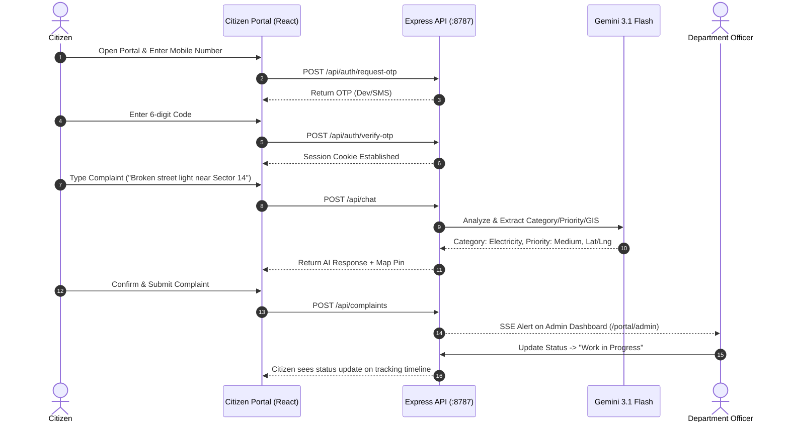

# 🔄 User Flow Documentation — CivicAI

```mermaid
sequenceDiagram
    autonumber
    actor Citizen
    participant UI as Citizen Portal (React)
    participant API as Express API (:8787)
    participant AI as Gemini 3.1 Flash
    actor Officer as Department Officer

    Citizen->>UI: Open Portal & Enter Mobile Number
    UI->>API: POST /api/auth/request-otp
    API-->>UI: Return OTP (Dev/SMS)
    Citizen->>UI: Enter 6-digit Code
    UI->>API: POST /api/auth/verify-otp
    API-->>UI: Session Cookie Established

    Citizen->>UI: Type Complaint ("Broken street light near Sector 14")
    UI->>API: POST /api/chat
    API->>AI: Analyze & Extract Category/Priority/GIS
    AI-->>API: Category: Electricity, Priority: Medium, Lat/Lng
    API-->>UI: Return AI Response + Map Pin

    Citizen->>UI: Confirm & Submit Complaint
    UI->>API: POST /api/complaints
    API-->>Officer: SSE Alert on Admin Dashboard (/portal/admin)

    Officer->>API: Update Status -> "Work in Progress"
    API-->>UI: Citizen sees status update on tracking timeline
```
