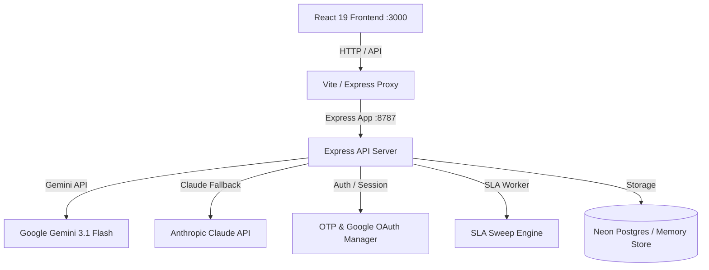

# 📊 System Architecture Diagrams

Contains visual architecture diagrams for **CivicAI**.

```mermaid
graph TD
    Client[React 19 Frontend :3000] -->|HTTP / API| Proxy[Vite / Express Proxy]
    Proxy -->|Express App :8787| API[Express API Server]
    API -->|Gemini API| AI[Google Gemini 3.1 Flash]
    API -->|Claude Fallback| Claude[Anthropic Claude API]
    API -->|Auth / Session| Auth[OTP & Google OAuth Manager]
    API -->|SLA Worker| SLA[SLA Sweep Engine]
    API -->|Storage| DB[(Neon Postgres / Memory Store)]
```
